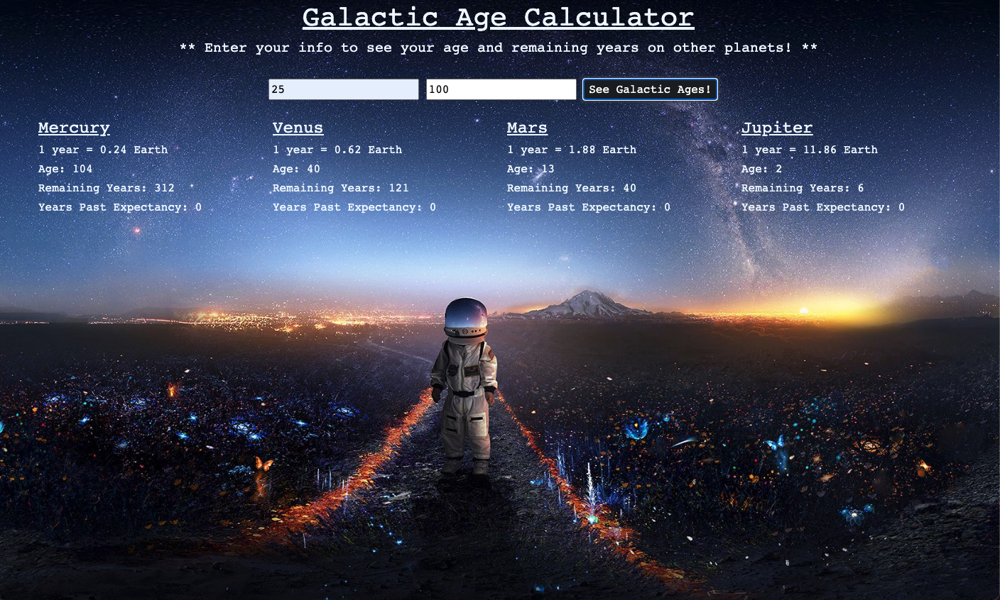
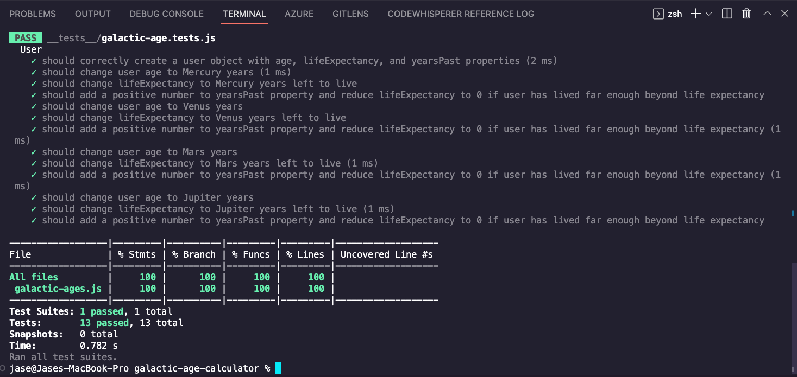

# Galactic Age Calculator

#### By Jase Seeley

#### Epicodus Week #5 Independent Code Review: Test-Driven Development and Environments with JavaScript  
* Find out how old you'd be on another planet. Fully Jest tested with 100% line coverage.

## Technologies Used
* HTML
* CSS
* Bootstrap
* JavaScript
* jQuery
* Popper
* Webpack
* ESLint
* Babel
* Jest

## Description

A calculator designed to determine your age and potential remaining years on Mercury, Venus, Mars, and Jupiter. Enter your current age and estimated life expectancy to see the conversion.

## Setup/Installation Requirements

* Visit https://jcseeley.github.io/galactic-age-calculator/ in your browser.
* Clone this repository to your desktop.
* Navigate to the top level of the directory in your terminal.
* Run "npm install"
* Run "npm run build" to build the project.
* Run "npm run start" to open the dev server. Or you can open a VS Code live server on the "index.html" file in the "dist" folder.
* Run "npm test" to run Jest tests.

## Known Bugs

* No known bugs at this time.

## License

MIT

Copyright (c) 2022 Jase Seeley  
